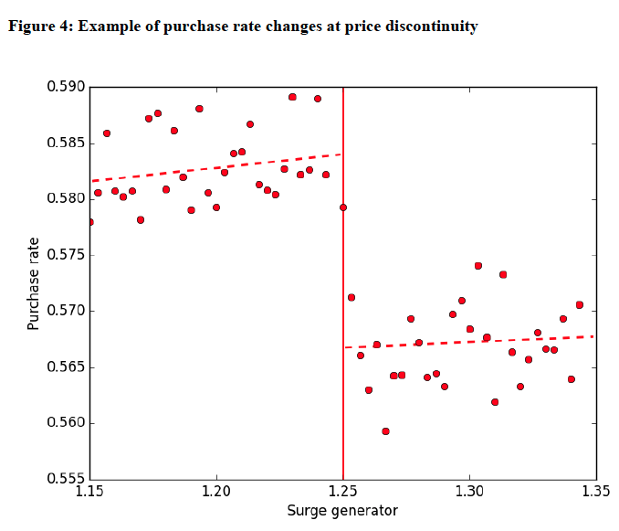

## 시작하며 

회귀단절 (Regression Discontinuity) 의 사례로 우버와 경제학 연구자들이 연구한 논문에 대해서 살펴보겠습니다. 

이 논문에서는 수요함수의 여러 지점들에서 "surge" 알고리즘과 회귀단절을 이용해서 수요의 가격탄력성을 구합니다. "surge" 관련 점수 컷오프(1.25)의 바로 직전 (예: 1.244) 와 바로 직후 (예: 1.266) 에서 소비자들의 특성들이 거의 유사할 때, 컷오프 직전과 직후의 가격 변화를 통해서 가격 탄력성을 구합니다. 

본인의 프로덕트의 알고리즘의 특징들을 이용하면, 컷오프 지점의 직전과 직후의 소비자들의 특성이 차이가 거의 없을 때, 알고리즘으로 인해 발생하는 특정 정책의 진전과 직후를 비교함으로써 원하는 정책의 효과를 분석할 수 있습니다. 

## Surge Pricing 알고리즘 

## 알고리즘과 회귀단절

우버의 알고리즘은 surge 에 관한 "surge generator" 라고 논문에서 부르는 연속적인 지표를 생성합니다. 이 지표의 전후 비교를 통해서 surge 지표의 변화가 구매율에 미치는 영향을 분석합니다. 

불연속적인 가격 변화에 따른 구매율 변화

## (옵션) 가격탄력성과 소비자 후생 (Consumer Surplus)

## Reference

- [Cohen et al. 2011, "Using Big Data to Estimate Consumer Surplus: The Case of Uber" NBER Working Paper version](https://www.nber.org/papers/w22627)

- [Zijing Zhu (2021), "An Introduction to Regression Discontinuity Design" 미디엄 블로그](https://www.nber.org/papers/w22627)

