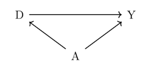
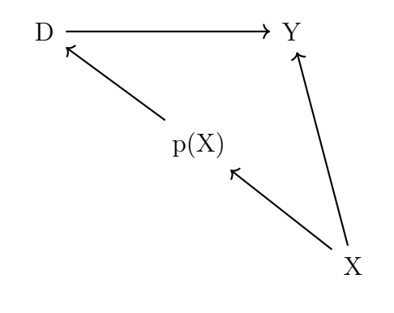
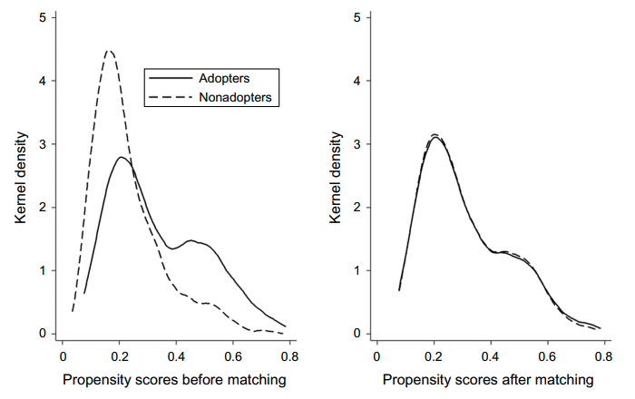

## 시작하며

새로운 프로덕트 런칭 등의 효과를 분석하는 일에는 A/B 테스팅과 같은 실험 방법론이 효과적이지만 윤리적인 문제나 기간적인 문제 또는 리소스 부족 등의 문제로 인해 도입하기 어려운 상황이 발생합니다. 이러한 상황에서 PSM (성향점수 매칭)), 이중차분, 회귀단절, 도구변수 등의 인과추론 방법론들을 고려해볼 수 있는데요, 이번 포스팅에서는 PSM 에 대해서 다루어보도록 하겠습니다. 

PSM 은 성향점수 매칭 방법은 유저(또는 일반적으로 관측치)가 정책(프로덕트 런칭 등)의 treatment 그룹에 속할 확률을 기반으로 treatment 그룹과 control 그룹을 나누는 방법입니다. 예를 들어, 새로운 음악 추천 서비스의 음악 소비에 대한 효과를 추정하고 싶다고 한다면, 새로운 음악을 들을 확률이 유사한 유저들 중에서 추천 서비스를 들은 사람들과 듣지 않은 사람들을 한 그룹으로 묶고, 각 그룹의 음악 소비량의 차이를 가중평균하여 분석가가 추정하고 싶은 효과를 추정합니다. 

PSM 은 이러한 매칭을 기반으로 하므로, subclassification 섹션에서는 매칭을 통해서 매칭 방법론의 직관을 이해하고, PSM 섹션에서는 보다 구체적으로 PSM 을 구하는 방법에 대해 논의하고, 마무리에서는 PSM 의 한계점에 대해서 논의해보도록 하겠습니다. 

## Subclassification
### 예시: 흡연과 사망률

아래 표에서는 흡연여부에 따른 사망률을 나타냅니다. 이 표를 보고 과연 흡연이 사망에 영향을 미치지 않는다고 주장할 수 있을까요? 

| 흡연그룹 | 사망률 | 
| ------ | ------ |
| 비흡연자 | 6.4% |
| 흡연자 | 6.4% |

주장이 타당하기 위해서는 아래 가정을 만족해야 합니다. 

$$E[Y^1 | 비흡연자] = E[Y^1 | 흡연자]$$
$$E[Y^0 | 비흡연자] = E[Y^0 | 흡연자]$$

즉, 흡연자가 담배를 피웠을 때의 사망률과 비흡연자가 담배를 피웠을 때의 사망률이 동일 하고, 흡연자가 담배를 피우지 않았을 떄의 사망률과 비흡연자가 담배를 피우지 않았을 때의 사망률이 동일해야 합니다.

다음 표에서처럼, 비흡연자의 평균 나이가 흡연자의 평균 나이에 비해 높았다고 해봅시다. 

| 흡연그룹 | 30세 | 50세 | 
| ------ | ------ | ------ |
| 비흡연자 | 600명 | 900명 |
| 흡연자 | 400명 | 100명 |

- 비흡연자의 평균 나이: 
$$ 30 \times \frac{600}{600+900} + 50 \times \frac{900}{600+900} = 42 $$

- 흡연자의 평균 나이: 
$$ 30 \times \frac{400}{400+100} + 50 \times \frac{100}{400+100} = 34 $$

비흡연자의 평균 연령이 흡연자의 평균 연령에 비해 높다는 것은 두 집단 모두 담배를 피 우지 않았더라도 사망률이 비흡연자의 경우 더 높았을 것을 의미합니다 (연령이 높아질수록 흡연자와 비흡연자 두 집단 모두에서 사망률이 높아진다고 가정하겠습니다). 다음 표에서처럼, 실재로 실제 사망률은 각 연령 집단에서 흡연자의 경우가 비흡연자의 경우에 비해 더 높았다고 해봅시다. 

| 흡연그룹 | 30세 | 50세 | 
| ------ | ------ | ------ |
| 비흡연자 | 1% | 10% |
| 흡연자 | 5% | 12% |

가장 처음 표의 사망률에 문제가 있었던 이유는 연령이라는 요소를 고려하지 않고 단순 계산 했기 때문입니다. 즉, 아래와 같은 방식으로 각 집단의 전체 명수를 해당 집단 중 사망자 수로 단순 계산하면 두 집단의 사망률이 동일하게 나옵니다.

- 비흡연자의 사망률 단순 계산: 
$$\frac{ 1 \\% \times 600 + 10 \\% \times 900 }{ 600 + 900} = 6.4 \\% $$

- 흡연자의 사망률 단순 계산: 
$$\frac{ 5 \\% \times 400 + 12 \\% \times 100 }{ 400 + 100} = 6.4 \\% $$

### DAG 그래프

사망률을 단순 계산할 경우 흡연자와 비흡연자의 사망률이 동일하게 나오는 이유는 아래 DAG 표와 같이 흡연 여부가 연령과 연관되기 때문입니다. 그리고, 위 표들과 같이, 흡연 여부에 따라서 연령 분포가 다르기 때문에 문제가 발생합니다.

### Identifying Assumption

흡연 여부가 사망률에 미치는 인과적 효과를 추정하기 위해서 아래 두 가정을 가정해봅니다.

1. CIA (Conditional Independent Assumption)
    - $(Y^1, Y^0 \perp D | X) $

2. Common Support Assumption
    - $0 < P(D=1 | X) < 1$ with probability one.

두 가정 하에서, 

$$ E[Y^1 - Y^0 | X ] = E [ Y | X, D=1] - E [ Y | X, D=0] $$
$$  = E [ Y^1 | X, D = 1] - E [ Y^0 | X, D = 0] $$
$$ = E [ Y | X, D = 1] - E [ Y | X, D = 0] $$
		
### Calculating Average Treatment Effect

위 예시에서 ATE 를 계산해봅니다. 

$$\hat{\delta}_{ATE}  = \int \Big( E[Y^1 - Y^0 | X ] \Big) d P(X) $$
$$ = \int \Big( E [ Y | X, D=1] -  E [ Y | X, D=0]  \Big) d P(X) $$
$$ = \Big[ E [Y | Age = 30, D= 1] - E [Y | Age = 30, D= 0]  \Big] \times P(Age = 30) $$
$$ + \Big[ E [Y | Age = 50, D= 1] - E [Y | Age = 50, D= 0]  \Big] \times P(Age = 50) $$
$$ = (5  - 1 \\%) \times \frac{600+400}{2000} + (12 \\% - 10 \\%) \times \frac{900+100}{2000} $$
$$ = 3 \\% $$

위의 사례에서는 characteristic 이 연령 하나였습니다. 만약, characteristic 이 많아진다면 어떻게 될까요? 예를 들어, 10개의 binary (0 또는 1)의 변수가 있으면, 210 = 1, 024 개의 subclass 를 만들어야 합니다. 개별 subclass 에 각각 treatment 그룹과 control 그룹이 모두 있으리라 보장하기 어렵습니다.

- 즉, Curse of dimensionality 문제가 발생합니다.

## Propensity Score Matching

### Introduction

PSM 기법은 curse of dimensionality 문제를 해소하고자 treatment 될 확률이라는 (벡터가 아 닌) 스칼라 값 하나로 표현하는 방법입니다. PSM 을 이용해 두 집단의 인과관계를 추론하는 스텝은 다음과 같습니다.

- 필요한 covariate 을 이용해서 treat 될 조건부 확률을 로짓이나 프로빗을 통해서 구합니다.
- Predicted value 를 이용해서 covariate 들을 스칼라 값인 propensity score 로 압축합니다.
- Treat 그룹과 control 그룹을 propensity score 를 바탕으로 비교합니다. Treatment 그룹의 샘플에서 유사한 propensity score 를 가진 control 그룹의 샘플과 매칭을 시켜줍니다.

### Fitted Value of Logistic Model

PSM 기법을 활용해 매칭을 해보겠습니다. 우선, 필요한 covairate 을 이용해서 treatment 그룹에 속할 조건부 확률을 로짓을 이용해서 구합니다.

1. 로짓 회귀식을 이용해 treatment 에 속할 conditional probability 를 구합니다.
    - $P(D=1 | X) = F(\beta_0 + \beta_1 Treat + \beta_2 X)$ where $F() = \frac{e}{1+e}$

### PSM Theorem 의 가정

- CIA 가정 하에서, 
    - $E[Y_i^1 | D_i = 1 , X_i = x] = E[Y_i | D_i = 1, X_i = x]$

- Common support assumption 가정 하에서, 위 두 식을 모두 구할 수 있습니다.
    - Common support 가정 : $0 < P(D_i = 1 | X_i) < 1$. 

- 두 가정 하에서 우리는 아래와 같은 PSM theorem 을 도출할 수 있습니다.
    - CIA 가정에서, $(Y^1, Y^0) \perp D | X$
    - 이로부터 $(Y^1, Y^0) \perp D | p(X)$ 를 도출할 수 있습니다. 

CIA 가정 하에서 treatment 와 Y 간의 독립을 보장하기 위해서는 propensity score 로 conditioning 하는 것이 충분합니다.

### DAG Graph for PSM

Propensity score 를 통제할 때 (conditional on) treatment 그룹의 covariate 의 분포와 control 그룹의 covariate 의 분포가 동일해집니다.

### 예시: 스포티파이

Datta et al. (2017)의 논문에서는 음악 유저들과 여러 플랫폼 사용 여부에 대한 데이터를 바탕으로 추천 프로덕트인 스포티파이의 사용 여부가 음악 소비량이 나 다양한 음악 소비 여부에 미치는 영향을 연구합니다. 이 연구에서는 PSM + DID 방법을 사용합니다.

아래 스포티파이의 예시를 보면, 매칭 전에는 (스포티파이 프로덕트) 경향성 점수 분포가 도입 집단과 비도입 집단 간에 차이를 보임을 알 수 있습니다. 매칭 이후에는 경향성 점수 분포가 두 집단 간에 거의 동일해집니다.

### Weighting on the Propensity Score

Propensity score 를 이용해서 ATE and ATT 를 추정할 수 있습니다.

$$\delta_{ATE}  = E [ Y^1 - Y^0] = E \Big[ Y \times \frac{D - p(X)}{p(X) (1-p(X))}   \Big]  $$

$$\delta_{ATT} = E [ Y^1 - Y^0 | D = 1]  = \frac{1}{P(D=1)} \times E \Big[ Y \times \frac{D - p(X)}{ 1 - p(X)} \Big]$$

### PSM 매칭 전후 결과 비교

미국에서 직업 훈련 프로그램의 효과에 관한 PSM 기법을 실험 기법과 비교한 논문들이 있습니다. 이 중에서 Dehejia and Wahba (1999)에서 두 방법론을 비교하는 논문이 있어 소개합니다. 

|    | (1) | (2) | 
| ------ | ------ | ------ |
| Comparison Group   |       | Matching | 
| Experimental | $1,672 |  |
|       | (638) |       |
| PSID | $731 | $1,473 |
|       | (851) | (800) |
| CPS | $1,672 | $1,616 |
|       | (550) | (751) |
- Estimated Training Effects using Propensity Scores (1) 열의 결과는 characteristic 이 통제된 결과.
- Dehejia and Wahba (1999) 의 Table 3에서 발췌. 

위 테이블에 따르면, PSID 와 CPS 데이터를 이용한 추정치는 실험 데이터를 이용한 추정 치에 비해 절반의 효과를 나타냅니다. 이러한 문제점은 matching 기법 이후에 해소되는 것으로 나타납니다. 

## 마무리하며

Propensity Score Matching 의 가장 큰 단점은 관측 불가능한 변수들을 통제하지 못한다는 점입니다. 관측 불가능한 변수들을 통제하면, 정책과 outcome 이 독립이다라는 CIA (Conditional Independent Assumption) 에 기반하고 있습니다. 따라서, 실무에서 CIA 를 가정할 수 있는지에 대한 고민이 선행되어야 합니다. 

위  글은 저의 [개인블로그](https://marvin-ds.tistory.com/24)에서도 읽으실 수 있습니다. 

## Reference

- [Causal Mixtape, "Matching and Subclassification"](https://mixtape.scunning.com/matching-and-subclassification.html)
- [Datta, H., G. Knox, and B. J. Bronnenberg. (2017). Changing their tune: How con- sumers’ adoption of online streaming affects music consumption and discovery, Marketing Science ."](https://pubsonline.informs.org/doi/abs/10.1287/mksc.2017.1051)
- [Dehejia, Rajeev H., and Sadek Wahba. 1999. “Causal Effects in Nonexperimental Studies: Reevaluating the Evaluation of Training Programs.” Journal of the American Statistical Association 94 (448): 1053–62.](https://www.tandfonline.com/doi/abs/10.1080/01621459.1999.10473858)